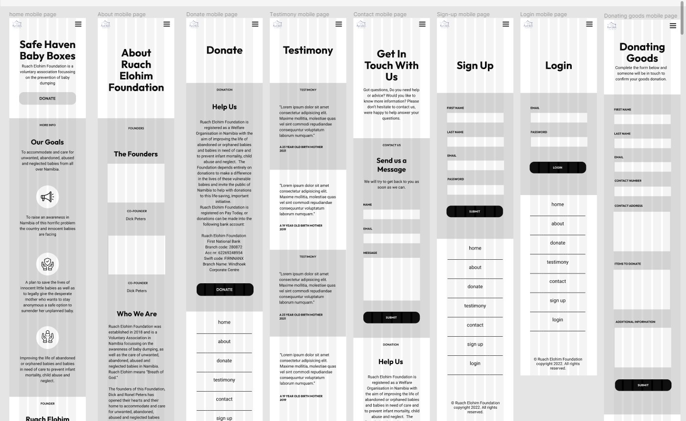
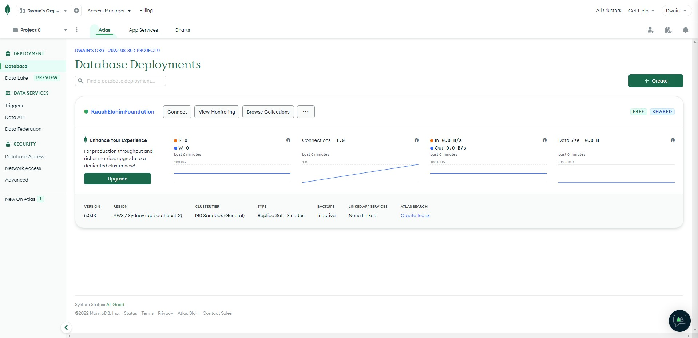
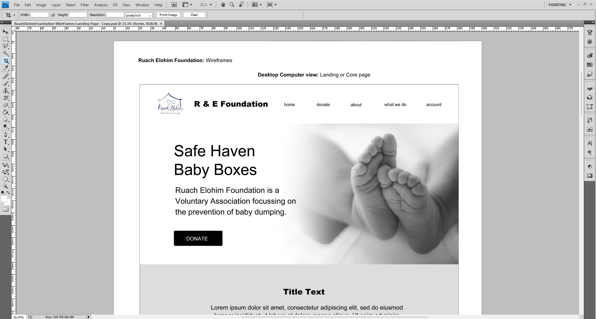
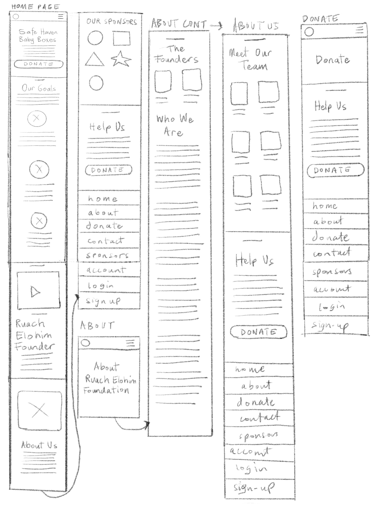
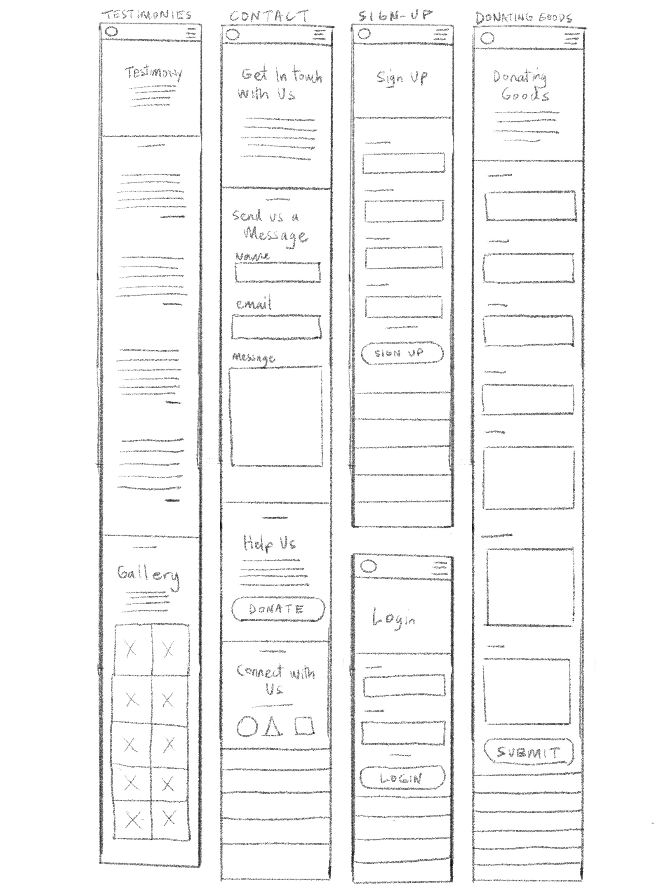

# Reflective Journal

# Table of Contents

## Individual Reflective Journal

1. [Reflective Journal for Project Proposal](#01proposal)

## Meetings

1. [Team Meeting 12 Oct 2022](#01meeting)
2. [Team Meeting 18 Oct 2022](#02meeting)
3. [Team Meeting 19 Oct 2022](#03meeting)
4. [Team Meeting 21 Oct 2022](#04meeting)
5. [Team Meeting 26 Oct 2022](#05meeting)
6. [Team Meeting 28 Oct 2022](#06meeting)
7. [Team Meeting 02 Nov 2022](#07meeting)
8. [Team Meeting 04 Nov 2022](#08meeting)
9. [Team Meeting 09 Nov 2022](#09meeting)
10. [Team Meeting 11 Nov 2022](#10meeting)

## Daily Status reports

1. [Daily Status report 17 Oct 2022](#01daily)
2. [Daily Status report 18 Oct 2022](#02daily)
3. [Daily Status report 19 Oct 2022](#03daily)
4. [Daily Status report 20 Oct 2022](#04daily)
5. [Daily Status report 21 Oct 2022](#05daily)
6. [Daily Status report 25 Oct 2022](#06daily)
7. [Daily Status report 26 Oct 2022](#07daily)
8. [Daily Status report 27 Oct 2022](#08daily)
9. [Daily Status report 28 Oct 2022](#09daily)
10. [Daily Status report 31 Oct 2022](#10daily)
11. [Daily Status report 01 Nov 2022](#11daily)
12. [Daily Status report 02 Nov 2022](#12daily)
13. [Daily Status report 03 Nov 2022](#13daily)
14. [Daily Status report 04 Nov 2022](#14daily)
15. [Daily Status report 07 Nov 2022](#15daily)
16. [Daily Status report 08 Nov 2022](#16daily)
17. [Daily Status report 09 Nov 2022](#17daily)
18. [Daily Status report 10 Nov 2022](#18daily)

## <mark>01 Team Meeting 12/10/2022</mark>

### Date

12 October 2022

### Start time

9.41 am

### Attendance

- John Wright
- Leone Krauze
- Brayden Dawson
- Dwain Aiolupotea

### Absent

0

### Agenda

- Wellington **Capstone Project** Setup
- Set up a new repo
- Set up a whiteboard

### Notes from the Meeting

- Leone shared a project idea about a foundation. Here is the facebook page for [Ruach Elohim Foundation](https://www.facebook.com/people/Ruach-Elohim-Foundation/100066462733417/)
- Brayden also came up with an idea about knowing what cafe's are open in your area and what food they serve along with pricing and coffee sizing.

### Meeting ended

10:16am

[Go back to Table of Contents](#toc)

## 01 Daily Status report 17/10/2022

### Date

17 October 2022

### What I completed today

I worked on the Team Contract and setting it up for the team.

### Any issues preventing you from progressing

I was distracted with finding other possible idea's for the software project. A game of some sort might be useful but it could be a waste of time.

### Actions taken

I had to brainstorm some idea's about a game that could be in support of the website.

### Smart goal for the next day

Begin to select collaboration tools appropriate for the team.

### Personal reflection

There was a bit of a delay in the project as we were still trying to come up with an idea for a software project. I think we really need to make decisions early and also communicate a lot between team members.

[Go back to Table of Contents](#toc)

## <mark>02 Team Meeting 18/10/2022</mark>

### Date

18 October 2022

### Start time

2.03 pm

### Attendance

- Leone Krauze
- Brayden Dawson
- Dwain Aiolupotea

### Absent

- John Wright

### Agenda

- Decide what Project we will work on for the assessment.

### Notes from the Meeting

- Decided on going with the website idea for the Namibian charity foundation named Ruach Elohim. This will be a static front-end website detailing important information about the organization and how to donate to the charity. This website will likely be deployed and used by the organization.
- Leone will begin with the requirements documentation.
- Leone showed us some websites that she researched that were similar to the foundation that we looked at. [Safe Haven Baby Boxes](https://shbb.org/), [American Adoptions](https://www.americanadoptions.com/pregnant/safe-haven-baby-box)
- Dwain and Brayden will begin with the wireframe designs.

### Meeting ended

3:05 pm

[Go back to Table of Contents](#toc)

## 02 Daily Status report 18/10/2022

### Date

18 October 2022

### What I completed today

I worked on some draft version wireframes for the Ruach Elohim website. Completed the home or landing page and about pages in photoshop.

### Any issues preventing you from progressing

I was still trying to complete the Team Contract and letting the team know to sign it.

### Actions taken

Put the team contract as first priority before starting the Wireframes.

### Smart goal for the next day

Use design software to create the wireframes.

### Personal reflection

Alway's check the team project proposal to keep track of what to do. Also try to communicate more with the team about what we need to do for next meeting.

[Go back to Table of Contents](#toc)

## <mark>03 Team Meeting 19/10/2022</mark>

### Date

19 October 2022

### Start time

2.30 pm

### Attendance

- Leone Krauze
- Brayden Dawson
- Dwain Aiolupotea
- Ying Chiu Goh (Lecturer)

### Absent

- John Wright

### Agenda

- Checkpoint: Organize a meeting with the lecturer to present clients requirements.

### Notes from the Meeting

- Leone presented our project to the lecturer
- Ying was happy with the progress and reminded us that the assessment needs a backend. Advised us to implement an administrator feature.
- Ying also gave us some links for us to look at [Words With Heart](https://wordswithheart.com/), [Baby Hatch](https://orphancare.org.my/baby-hatch/)
- Ying also advised us to create a github project board for the software project [Project Board](https://github.com/orgs/ITwhitecliffe/projects/1/views/1) but Brayden was happy to do that for the team.

### Meeting ended

2:49 pm

[Go back to Table of Contents](#toc)

## 03 Daily Status report 19/10/2022

### Date

19 October 2022

### What I completed today

I completed the draft version of the wireframes for the Ruach Elohim foundation. And sent it to the team for feedback and modifications.

### Any issues preventing you from progressing

I was a bit lost with what kind of content to put in the wireframes.

### Actions taken

I just put placeholder text or lorim ipsum and basic shapes for icons, images and logos.

### Smart goal for the next day

- Get some feedback and begin to modify the wireframes.
- Set up the MongoDB Atlas database for the project

### Personal reflection

I think I need to start to slowly learn some Advanced JavaScript on the side to master the language.

[Go back to Table of Contents](#toc)

## 04 Daily Status report 20/10/2022

### Date

20 October 2022

### What I completed today

- I modified the wireframes based on Leone's feedback. To include login/account link in the navigation bar.
- Set up the MongoDB Atlas database for the project.

### Any issues preventing you from progressing

- I was a little bit distracted with trying to fix my desktop computer as a backup machine just in case my laptop failed. Discovered that the expensive graphics card was dead. So I pulled it out and used the motherboards graphics instead.
- I've started to notice that my laptop is slowing down a lot and will need to prepare my desktop computer for this project.

### Actions taken

Begin transitioning my files over to the desktop and install all the software needed to get up and running.

### Smart goal for the next day

Look again at the assessment and check what else needs to be done.

### Personal reflection

I think I need to start to slowly learn some Advanced JavaScript on the side to master the language.

[Go back to Table of Contents](#toc)

## <mark>04 Team Meeting 21/10/2022</mark>

### Date

21 October 2022

### Start time

10.00 am

### Attendance

- Leone Krauze
- Brayden Dawson
- Dwain Aiolupotea

### Absent

- John Wright

### Agenda

Stand up meeting: Finalize Team Contract, Project planning document, Wireframes

### Notes from the Meeting

- Team Contract: Dwain is almost finished the Team contract and waiting for the team to sign
- Project planning: Leone has the business requirements done just waiting on feedback from the team. Leone will also work on the design document as well.
- Wireframes: Dwain is still working on the wireframes, and finished the landing pages now going to move to the other pages. Brayden will start following behind Dwain and add the mockup versions.

### Meeting ended

10:46 am

[Go back to Table of Contents](#toc)

## 05 Daily Status report 21/10/2022

### Date

21 October 2022

### What I completed today

- I completed the Team Contract
- I completed the draft Wireframes for the landing page

### Any issues preventing you from progressing

- When I was designing the wireframes in Photoshop is was very sluggish and took too long.
- Brayden suggested using Figma and it was a better solution as the whole team can add their changes.

### Actions taken

Decided to move all the wireframes to Figma online app and it was a lot faster to design things.

### Smart goal for the next day

- Begin working on the other page designs for the wireframes
- Begin working on the mockups and look at some colour schemes

### Personal reflection

- Communication is really important and daily stand-up meetings really help with progress.
- What doesn't work well is having to learn something new all the time especially if you have a deadline.
- We were down one team member for a couple of days but what I've learned is, you have embrace change and have knowledge in all areas of a project in order to be flexible.

[Go back to Table of Contents](#toc)

## 06 Daily Status report 25/10/2022

### Date

25 October 2022

### What I completed today

- Completed the home pages, about pages wireframes

### Any issues preventing you from progressing

- I wasn't sure what to do next after the home and about pages.

### Actions taken

Go back to the requirements documentaion

### Smart goal for the next day

- Finish wireframes

### Personal reflection

- Keep members updated on progress. Communicate often and keep positive.
- Ask for help and learn from those that are more experienced.

[Go back to Table of Contents](#toc)

## <mark>05 Team Meeting 26/10/2022</mark>

### Date

26 October 2022

### Start time

10.00 am

### Attendance

- Leone Krauze
- Brayden Dawson
- Dwain Aiolupotea
- John Wright

### Absent

0

### Agenda

Stand up meeting:

- Wireframes
- Decide if we are going to do wireframes
- Ask Leone about images for mockups
- Proof read business requirements doc
- Proof read system design doc
- Begin a project dev log doc and add any design changes and reason
- Team to sign contract
- Discuss what will be worked on in the coming days

### Notes from the Meeting

- Wireframes complete small changes to the gallery page to remove baby photos and add anonymous testimonials instead
- add video to the website possibly the landing page
- research Go fund me accounts and how to add the link into website
- begin working on mockups and adding themes and colours
- create context, user role and business domain diagrams and add them to business requirements docs
- changes to be made to planning docs after reproof reading.
- Todays take-away
  - John to edit planning docs
  - Leone to begin development log documentation
  - Dwain and Brayden to continue UI/UX

### Meeting ended

11:04 am

[Go back to Table of Contents](#toc)

## 07 Daily Status report 26/10/2022

### Date

26 October 2022

### What I completed today

- I completed moving the designs from photoshop to online Figma app and did the draft version of the wireframes and just need some feedback.

### Any issues preventing you from progressing

- A little bit tired from working on the wireframes late last night.

### Actions taken

I think I will need a little bit of a break.

### Smart goal for the next day

- Start working on the new changes from our meeting
- Begin work on UI/UX designs with Brayden
- Learn some JavaScript too.

### Personal reflection

- Don't be a hero, get plenty of rest and look after yourself.

[Go back to Table of Contents](#toc)

## 08 Daily Status report 27/10/2022

### Date

27 October 2022

### What I completed today

- I completed sketches for the mobile wireframes for the Software Project, Ruarch & Elohim Foundation.

### Any issues preventing you from progressing

- There were some undecided parts of the wireframes that needed changes but I wasn't sure what they were.

### Actions taken

- I will confirm the changes with the team and sort out the wireframes asap.
- I also think the navigation on the footer also needs to be resolved as well. I will need to confirm that with the team.

### Smart goal for the next day

- Use the mobile wireframe sketches and design it in Figma.
- Confirm with the team about doing wireframes for a tablet size wireframes.
- Continue learning some JavaScript by building a Weather map API website.

### Personal reflection

- What's working well is everyone in the team has a task to work on.
- What hasn't been working well is some decisions need to be confirmed.
- What we can do better is keep communicating and often.

[Go back to Table of Contents](#toc)

## 09 Daily Status report 28/10/2022

### Date

28 October 2022

### What I completed today

- I completed the mobile wireframes for the Ruarch & Elohim Foundation software project in Figma.

### Any issues preventing you from progressing

- There were still some undecided parts of the wireframes that needed changes but I wasn't sure what they were.
- I will probably need to address the footer navigation
- Need to address the donation info as well
- Wasn't sure if we needed to do some tablet wireframes.

### Actions taken

- Sort out the issues with the wireframes

### Smart goal for the next day

- Confirm if we need to do some tablet wireframes

### Personal reflection

- What went well today was working together with Brayden on the wireframes.
- What issues were met were the comments addressed by Brayden about the designs in the mockups and how they were resolved through replying back to his comments about the mockups. Like the amount of gradients, the quotes in the testimonies design section and which picture to select for the hero section of the home page.
- What could be improved next time is to may be record go through the wireframes together and get feedback.

[Go back to Table of Contents](#toc)

## <mark>06 Team Meeting 28/10/2022</mark>

### Date

28 October 2022

### Start time

2.10 pm

### Attendance

- Leone Krauze
- Brayden Dawson
- Dwain Aiolupotea
- John Wright

### Absent

0

### Agenda

Stand up meeting:

- Design document
- mockups
- footer design
- control book
- wireframes
- model diagram

### Notes from the Meeting

- John will do the Model diagram
- The whole team made some design decisions for the mockups by Brayden in Figma
- Leone will do a control book for the whole team project
- John would like the team check and read over the documentation

### Meeting ended

3:18 pm

[Go back to Table of Contents](#toc)

## 10 Daily Status report 31/10/2022

### Date

31 October 2022

### What I completed today

- I completed the modifications for the footer navigation for the desktop and mobile wireframes.

### Any issues preventing you from progressing

- I spent a few hours learning JavaScript.

### Actions taken

- I think I should manage my time learning JavaScript. Spend about an hour a day.

### Smart goal for the next day

- Finalize wireframes and mockups.

### Personal reflection

- The team is working on their own tasks.
- We had a few days without a stand up meetings.
- I guess we can use the chat to do stand ups.

[Go back to Table of Contents](#toc)

## 11 Daily Status report 01/11/2022

### Date

01 November 2022

### What I completed today

- I completed the homepage for the Tablet wireframes
- Read through the requirements and Design Documents and modified some content

### Any issues preventing you from progressing

- I had a offer to do some paid design work from a protential client
- I went over the one hour limit of learning JavaScript

### Actions taken

- I will need to stick to the learning JavaScript for 1 hour a day.
- Begin a plan to manage my time with the new design work.

### Smart goal for the next day

- Complete the tablet wireframes.
- Check what else I need to do for the assessment deadline on Sunday.

### Personal reflection

- The team are all working on their own to finish the tasks.
- Communication is a little absent between members today.
- I think we need to may be report our progress in the chat.

[Go back to Table of Contents](#toc)

## 12 Daily Status report 02/11/2022

### Date

02 November 2022

### What I completed today

- I completed the tablet wireframes

### Any issues preventing you from progressing

- The figma file is beginning to increase in size and beginning to slow down.
- The assests for the project like images for sponsors, social media are only a few. So the website looks empty.

### Actions taken

- Delete some elements in the figma file that are not being used to speed up the figma project.
- May be add a few images to the website to make it more interesting.

### Smart goal for the next day

- Work on One design feature x3
- Work on Team work reflection: Individual and team evaluation
- explanation of how the project addresses the sustainability, equality, social or contemporary cultural issues show a thorough understanding.

### Personal reflection

- What went well was completing the tasks individually
- What didn't go well was working on your own can be unmotivating
- What we can do better is keep communicating amongst team members.

[Go back to Table of Contents](#toc)

## <mark>07 Team Meeting 02/11/2022</mark>

### Date

02 November 2022

### Start time

2.30pm

### Attendance

- Leone Krauze
- Brayden Dawson
- Dwain Aiolupotea
- John Wright

### Absent

0

### Agenda

Stand up meeting:

- Client communication
- Control book
- boiler plate
- meeting with lecturer

### Notes from the Meeting

- Business requirements finished. We just need to add the wireframes.
- Solution design document finished. We just need to add UI/UX mockups.
- Decided to use a sticky header in the UI and add a floating 'back to top' button that appears down one margin of the screen.
- Leone created a control book for the software project. The team will check it out.
- The client speaks in Afrikaan so we decided to communication through Leone who speaks the language. Use snapchat instead to communicate to the client. Leone will record the communication.
- Do we need to have a meeting with lecturer for the proposal? We will contact our lecturer to confirm.
- Leone will set up the code Boiler plate and contact the client.
- Dwain will set up the database MongoDB Atlas cluster and begin with database connection.
- John will add design screenshots to the document and create boiler plate code for front-end
- Brayden will finish all the website mock-ups
- 4th November 2022: Friday 10am meeting with our lecturer has been confirmed.
- Aiming to have tasks completed by next Monday 7th November 2022.

### Meeting ended

3:20pm

[Go back to Table of Contents](#toc)

## 13 Daily Status report 03/11/2022

### Date

03 November 2022

### What I completed today

- I completed the task of setting up a MongoDB Atlas database for the software project.
- I also sent out invitations to the team to give them access to the database ready for the development stage,

### Any issues preventing you from progressing

- I spent too much time trying to test the markdown styling on this file.
- I also spent too much time learning JavaScript and spent more than the usual 1 hour limit.

### Actions taken

- Be more disciplined with my time and also have breaks.
- Use the Pomodoro timer each day.

### Smart goal for the next day

- Begin preparing for the Software proposal hand in on Sunday.
- Update my personal journal and add the required information for submission.

### Personal reflection

- What went well with the team was we managed to finish everything early.
- What didn't go well was we didn't review and finalize most of our work and tasks.
- What we can improve is having a macro view of the whole project where we can see where we are in the whole scheme of things.

[Go back to Table of Contents](#toc)

## <mark>08 Team Meeting 04/11/2022</mark>

### Date

04 November 2022

### Start time

10.00am

### Attendance

- Leone Krauze
- Dwain Aiolupotea
- John Wright
- Ying Ching Goh (Lecturer)

### Absent

- Brayden Dawson (Sick)

### Agenda

Team and Lecturer meeting:

- Present our proposal to our lecturer for feedback.

### Notes from the Meeting

- Is there a way for an admin team to update the content? We can add invisible links that an admin team have access to. To enable the changing of content.
- A link for Interactive design components in [figma](<https://www.figma.com/file/YmYHO4Qm058zaPhveGL2SQ/Interactive-Components---Playground-File-(Community)?node-id=2%3A42>)
- Work on the front-end in the first week and then work on the back-end on the second week.
- Gift exchange style shopping cart. Like Amazon wishlist - buy items that the foundation needs for them. Perhaps for the next phase of development.

### Meeting ended

10:23am

[Go back to Table of Contents](#toc)

## 14 Daily Status report 04/11/2022

### Date

04 November 2022

### What I completed today

- I completed the task of turning the figma wireframes to a prototype

### Any issues preventing you from progressing

- I had a meeting today with our lecturer
- I had a tutorial today with our lecturer

### Actions taken

- Find ways to be more productive and use my time more wisely

### Smart goal for the next day

- Get the back-end ready for development

### Personal reflection

- What went well today was learning new things about figma and learning more about the project.
- What didn't go well was not asking enough questions.
- What I can improve is to be open and also learn from mistakes.

[Go back to Table of Contents](#toc)

## Individual Reflective Journal for the Software Project Proposal

### 1. Summary of personal contributions:

#### The tasks I completed

The tasks I completed were:

TEAM CONTRACT

I worked on the Team Contract and set that up for the Team to sign.

WIREFRAMES

Desktop

Mobile

Tablet

DATABASE

I completed the task of setting up the MongoDB Atlas database for the software project web application.

### 2. One design commentary:

#### Explanation of one design feature in each app that I contributed to (three in total). And the evidence of my contribution.

Design feature in the Website application that I contributed to were:

WIREFRAMES

I worked on some draft version of the landing page wireframes for the Ruach Elohim Foundation website in Photoshop. I sent the wireframes to the team for feedback and for modifications.

I modified the landing page draft wireframes by adding login or account link in the navigation bar.
We decided to move all the designs from Photoshop to online app, Figma for collaboration and live feedback. As that was much easier for us as a team to comment and quickly get feedback on the UI/UX designs.

Completed the rest of the wireframes for desktop. Then after completing the desktop version I struggled to design the mobile versions. So I though of sketching the mobile versions as it was quicker and much easier to do than in Figma.

So I started sketching out the mobile design by using the desktop as a guide. It was much more difficult to do as there was very little space to work with.

Creating the mobile versions of the wireframes took a lot longer than I thought. I found I had to extend the frame of the mobile down longer to accommodate the shift of the layout to a column structure. I also left out a lot of images as I know that on mobile images can eat up a lot of data.

Completed mobile wireframes. I chose to use just black, white and gray to only focus on the design aspects and the UI/UX elements.

Now after completing the mobile wireframes, I got to designing the tablet wireframes. It was a lot easier as I had a fair idea of what the UI/UX will look like for a tablet as I was familiar with both desktop and mobile.

### 3. A Reflection on the Teamwork:

#### What went well

What went well with the team was how easy it was to just allocate the tasks that we needed to do for the project. What also went well was the whole team was available and the team didn’t have any other commitments like work. We really had a team that was positive and approached the tasks by volunteering themselves. Communication was responsive in the teams chat and our meetings were really productive and positive. We all gave each other feedback on our work and also supported each other by looking over each other’s work.

#### What issues were met and how they were resolved

**1 ISSUE**

What issues were met during the project was that one of our team members had a family issue to deal with. It was right after we started the project and for a few days we had to continue on with the tasks with one team member missing. It really slowed us down and we just couldn’t finish the tasks fast enough.

**1 RESOLUTION**

How we solved the issue of the missing team member was we took on more tasks. Also we recorded our meetings and kept records of our plans for the missing team member to be able update themselves quickly once they decide to get back to the project.

**2 ISSUE**
Another issue we had was the client was on the other side of the world and spoke in another language. Our only way to contact the client was through one of our team members who spoke and understood the language. A meeting with the client would be difficult because of the difference in time zones.

**2 RESOLUTION**
How we solved the issue with the client was the team decided to communicate to the client through the team member that spoke the language.

#### What could be improved next time.

What could be improved next time would be, to create a contingency plan for unexpected issues like an absent team member. We could have created a risk management system document to outline all the possible risks and create a plan to mitigate each of those risks.

### 4. A reflection on how this project can address some sustainability, equity, social or contemporary cultural issues. Possible issues to touch upon may include; Sustainable travel, Preserving cultural traditions, Designing products for sustainability;

#### The social issues the solution addresses

**SOCIAL ISSUE**

The social issues that we addressed was the rise of deliberate baby dumping in Namibia. A serious social issue of mothers with unplanned pregnancies or unwanted babies to choose to dump or kill their own babies.

**SOLUTION**

The solution for the issue was to create awareness and to prevent unsafe baby dumping through the creation of a website. The website was also a way to also help raise funds via donations and also an avenue for people to donate goods to the foundation.

[Go back to Table of Contents](#toc)

## 15 Daily Status report 07/11/2022

### Date

07 November 2022

### What I completed today

- I completed the task of adding animations to the prototypes in figma.

### Any issues preventing you from progressing

- I had to baby sit one of my sick nieces.

### Actions taken

- Shift my working schedule later in the day.

### Smart goal for the next day

- Add more animations to the prototypes mobile version in figma.

### Personal reflection

- What went well today was doing a standup meeting in chat
- What didn't go well was not being able to get things done due to other commitments.
- What I can improve is try to work around interuptions when they arise.

[Go back to Table of Contents](#toc)

## 16 Daily Status report 08/11/2022

### Date

08 November 2022

### What I completed today

- I completed the task of finishing the prototypes for Wireframes and prototypes in figma.

### Any issues preventing you from progressing

- I had to learn how to use components and variants in figma to get the prototype working on mobile menu.

### Actions taken

- watched a tutorial about how to implement components and variants in figma.

### Smart goal for the next day

- Learn reactJS and NodeJS and back-end development

### Personal reflection

- What went well today was learning some new things in figma
- What didn't go well was it took up a lot of time to learn figma
- What I can improve is take notes and keep learning.

[Go back to Table of Contents](#toc)

## <mark>09 Team Meeting 09/11/2022</mark>

### Date

09 November 2022

### Start time

11.30am

### Attendance

- Leone Krauze
- Dwain Aiolupotea
- John Wright
- Brayden Dawson

### Absent

- 0

### Agenda

Team and Lecturer meeting:

- Development

### Notes from the Meeting

- Watching Tutorials ReactJS and Tailwind
- The web app is in a skeleton like app at the moment
- Dwain will do the API calls authentication/authorisation
- Leone will do the sign-up and login pages
- John will do navigation
- Brayden will do all the background and styling: Footer
- Send website assests: icon of logo, gradient photo for hero section in a folder to the team.

### Meeting ended

- 12:11pm

[Go back to Table of Contents](#toc)

## 17 Daily Status report 09/11/2022

### Date

09 November 2022

### What I completed today

- Today I completed the task of cloning the Software project repository on github.

### Any issues preventing you from progressing

- I was spending a lot of time learning ReactJS from our tutor today.

### Actions taken

- I will have to learn more NodeJS, MongoDB, ExpressJS, Mongoose and Authorisation/Authentication for the software project.

### Smart goal for the next day

- Start implementing the database connection

### Personal reflection

- What went well today was learning the basics of ReactJS
- What didn't go well was it's still very difficult to learn and retain what I've learned.
- What I can improve is take notes while learning and to realise that my knowledge in JavaScript is a work in progress.

[Go back to Table of Contents](#toc)

## 18 Daily Status report 10/11/2022

### Date

10 November 2022

### What I completed today

- Today I completed the task of cloning the software project repo. Installing the all the dependencies.
- I completed the task of setting up the server with NodeJS and ExpressJS.

### Any issues preventing you from progressing

- The issues today was cloning the repo and installing the dependencies. I had a lot of issues with dependency errors and had to delete the whole project about five times and to start all over again.

### Actions taken

- The action I had taken was to resolve the dependency issues as quick as possible to get a running web application.

### Smart goal for the next day

- Implement a connection from the server to the MongoDB Atlas database.

### Personal reflection

- What went well today was I managed to set up the server quite successfully.
- What didn't go well was the installation of the dependencies.
- What I can improve is work through the issues by having a break and then coming back to it.

[Go back to Table of Contents](#toc)

## <mark>10 Team Meeting 11/11/2022</mark>

### Date

11 November 2022

### Start time

11.00 am

### Attendance

- Leone Krauze
- Dwain Aiolupotea
- John Wright
- Brayden Dawson

### Absent

- 0

### Agenda

Team meeting:

- Standup

### Notes from the Meeting

- John completed the navigation and styling the links
- Dwain will send original file of the logo to the team
- Brayden completed the footer styling the links
- Leone will be working on the signup and login pages
- Discussed hover for effect for links lift
- Team will think of CRUD features for Admin role to modify testimony page
- Discussed deploying the project live

### Meeting ended

- 12:00 pm

[Go back to Table of Contents](#toc)

## 19 Daily Status report 11/11/2022

### Date

11 November 2022

### What I completed today

-

### Any issues preventing you from progressing

-

### Actions taken

-

### Smart goal for the next day

-

### Personal reflection

-

[Go back to Table of Contents](#toc)
